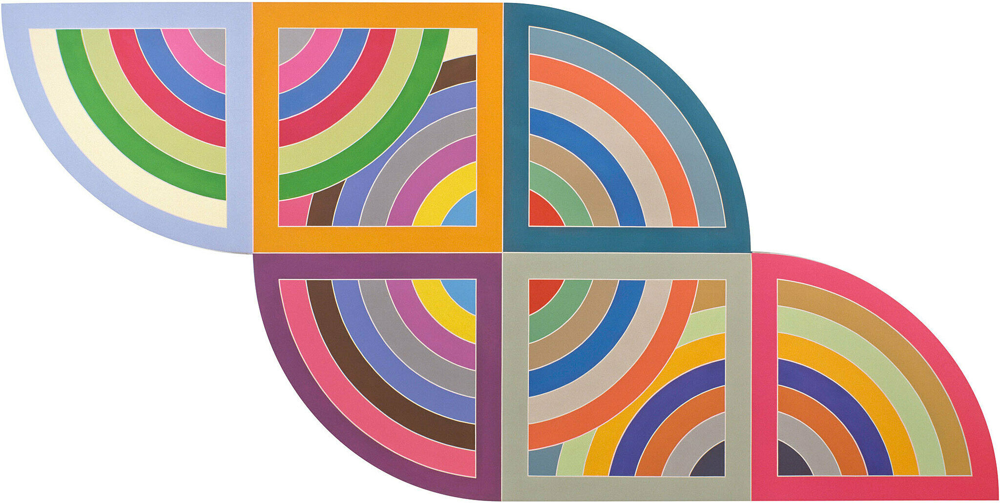

# CSC 272: Data Mining (under construction)

 
<!--  -->

<a href="https://en.wikipedia.org/wiki/Julie_Mehretu">Julie Mehretu <i>Retopistics: A Renegade Excavation</i>, 2001</a>

<!--  -->
<!-- 
<a href="https://www.guggenheim.org/artwork/4003">Frank Stella <i>Harran II</i>, 1967</a>
 -->

## Announcements

{: .deadline }
Assignment 1 due _September 1st_

{: .notice }
Please submit the pre-course survey 

{: .good }
Welcome to CSC-272: Data Mining course! 
